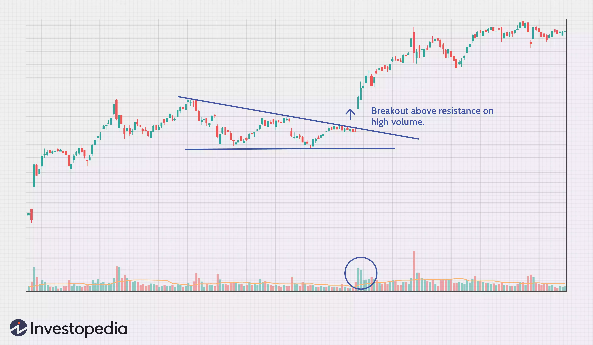

**Breakout** Definition and Example
===============================

What Is a Breakout?
-------------------

A breakout refers to when the price of an asset moves above a [resistance](https://www.investopedia.com/terms/r/resistance.asp) area, or moves below a [support](https://www.investopedia.com/terms/s/support.asp) area. Breakouts indicate the potential for the price to start [trending](https://www.investopedia.com/terms/t/trend.asp) in the breakout direction. For example, a breakout to the upside from a [chart pattern](https://www.investopedia.com/articles/technical/112601.asp) could indicate the price will start trending higher. Breakouts that occur on high [volume](https://www.investopedia.com/terms/v/volume.asp) (relative to normal volume) show greater conviction which means the price is more likely to trend in that direction.

### KEY TAKEAWAYS

-   A breakout is when the price moves above a resistance level or moves below a support level.
-   Breakouts can be subjective since not all traders will recognize or use the same support and resistance levels.
-   Breakouts provide possible trading opportunities. A breakout to the upside signals traders to possible get long or cover short positions. A breakout to the downside signals traders to possibly get short or to sell long positions.
-   Breakouts with relatively high volume show conviction and interest, and therefore the price is more likely to continue moving in the breakout direction.
-   Breakouts on low relative volume are more prone to failure, so the price is less likely to trend in the breakout direction.

What Does a Breakout Tell You?
------------------------------

*A breakout occurs because the price has been contained below a resistance level or above a support level, potentially for some time.* The resistance or support level becomes a line in the sand which many traders use to set entry points or [stop loss levels](https://www.investopedia.com/terms/s/stop-lossorder.asp). When the price breaks through the support or resistance level traders waiting for the breakout jump in, and those who didn't want the price to breakout exit their positions to avoid larger losses.

This flurry of activity will often cause volume to rise, which shows lots of traders were interested in the breakout level. The higher than average volume helps confirm the breakout. If there is little volume on the breakout, the level may not have been significant to a lot of traders, or not enough traders felt convicted to place a trade near the level yet. These low volume breakouts are more likely to [fail](https://www.investopedia.com/terms/f/failedbreak.asp). In the case of an upside breakout, if it fails the price will fall back below resistance. In the case of a downside breakout, often called a [breakdown](https://www.investopedia.com/terms/b/breakdown.asp), if it fails the price will rally back above the support level it broke below.

Breakouts are commonly associated with [ranges](https://www.investopedia.com/terms/r/rangeboundtrading.asp) or other [chart patterns](https://www.investopedia.com/terms/f/footprint-charts.asp), including triangles, flags, wedges, and head-and-shoulders. These patterns are formed when the price moves in a specific way which results in well-defined support and/or resistance levels. Traders then watch these levels for breakouts. They may initiate long positions or exit short positions if the price breaks above resistance, or they may initiate short positions or exit long position if the price breaks below support.

Even after a high volume breakout, the price will often (but not always) [retrace](https://www.investopedia.com/terms/r/retracement.asp) to the breakout point before moving in the breakout direction again. This is because short-term traders will often buy the initial breakout, but then attempt to sell quite quickly for a profit. This selling temporarily drives the price back to the breakout point. If the breakout is legitimate (not a failure), then the price should move back in the breakout direction. If it doesn't, it's a failed breakout.

Traders who use breakouts to initiate trades typically utilize stop loss orders in case the breakout fails. In the case of going long on an upside breakout, a stop loss is typically placed just below the resistance level. In the case of going short on a downside breakout, a stop loss is typically placed just above the support level that has been breached.

Example of a Breakout
---------------------

The chart shows a large increase in volume, associated with an [earnings](https://www.investopedia.com/terms/e/earnings.asp) release, as the price breaks through the resistance area of a triangle chart pattern. The breakout was so strong that it caused a price [gap](https://www.investopedia.com/terms/g/gap.asp). The price continued to move higher and didn't retrace to the original breakout point. That is a sign of a very strong breakout.

Traders could have used the breakout to potentially enter long positions and/or get out of short positions. If entering long, a stop loss would be placed just below the resistance level of the [triangle](https://www.investopedia.com/terms/t/triangle.asp) (or even below triangle support). Because the price had a large gaping breakout, this stop loss location may not be ideal. After the price continued to move higher following the breakout the stop loss could be [trailed](https://www.investopedia.com/video/play/how-use-trailing-stops/) up in order to reduce risk or lock in a profit.

The Difference Between a Breakout and a 52-Week High/Low
--------------------------------------------------------

A breakout could result in the price moving to a new [52-week high or low](https://www.investopedia.com/terms/1/52weekhighlow.asp), if a breakout occurs near the prior high/low. But not all 52-week highs/lows are the result of a recent breakout. A 52-week high or low is simply the highest or lowest price seen over the last year. A breakout is a move above or below resistance.

Limitations of Using Breakouts
------------------------------

There are two main problems with utilizing breakouts. The main problem is failed breakouts. The price will often move just beyond resistance or support, luring in breakout traders. The price then reverses and doesn't continue moving in the breakout direction. This can happen multiple times before a real breakout occurs.

Support and resistance levels are also subjective. Not everyone cares about the same support and resistance levels. This is why watching volume helps. An increase in volume on the breakout shows that the level is important. Lack of volume shows the level is not important or that the big traders (who create big volume) aren't ready to participate yet.

--- 
---
