**Candlestick `patterns`**
===

A daily candlestick charts shows the security’s open, high, low, and close price for the day. The candlestick’s wide or rectangle part is called the “real body” which shows the link between opening and closing prices.

This real body shows the price range between the open and close of that day’s trading.

When the real body is filled, black or red then it means that the close is lower than the open and is known as the bearish candle. It shows that the prices opened, the bears pushed the prices down and closed lower than the opening price.

If the real body is empty, white or green then it means that the close was higher than the open known as the bullish candle. It shows that the prices opened, the bulls pushed the prices up and closed higher than the opening price.

- The thin vertical lines above and below the real body is knowns as the wicks or shadows which represents the high and low prices of the trading session.
- The upper shadow shows the high price and lower shadow shows the low prices reached during the trading session.
- Strength is represented by a bullish or green candle and weakness by a bearish or red candle. One should ensure that whenever they are buying it is a green candle day and whenever they are selling, ensure that it’s a red candle day.
- The textbook definition of a patterns states certain criteria, but one should state that there could be minor variations to the pattern depending on certain market conditions.
- One should look for a prior trend. If you are looking at a bullish reversal pattern, then the prior trend should be bearish and if you are looking for a bearish reversal pattern then the prior trend should be bullish.

Here are the types of patterns

- [Bullish candlestick patterns](#bullish-candlestick-patterns)
  - [Hammer](#hammer)
  - [Piercing Pattern](#piercing-pattern)
  - [Bullish Engulfing](#bullish-engulfing)
  - [Morning Star](#morning-star)
  - [Three White Soldiers](#three-white-soldiers)
  - [White Marubozu](#white-marubozu)
  - [Three Inside Up](#three-inside-up)
  - [Bullish Harami](#bullish-harami)
  - [Tweezer Bottom](#tweezer-bottom)
  - [Inverted Hammer](#inverted-hammer)
  - [Three Outside Up](#three-outside-up)
  - [On-Neck](#on-neck)
  - [Bullish Counterattack](#bullish-counterattack)
- [Bearish candlestick patterns](#bearish-candlestick-patterns)
  - [Hanging Man](#hanging-man)
  - [Dark Cloud Cover](#dark-cloud-cover)
  - [Bearish Engulfing](#bearish-engulfing)
  - [Evening Star](#evening-star)
  - [Three Black Crows](#three-black-crows)
  - [Black Marubozu](#black-marubozu)
  - [Three Inside Down](#three-inside-down)
  - [Bearish Harami](#bearish-harami)
  - [Shooting Star](#shooting-star)
  - [Tweezer Top](#tweezer-top)
  - [Three Outside Down](#three-outside-down)
  - [Bearish Counterattack](#bearish-counterattack)
- [Continuation candlestick patterns](#continuation-candlestick-patterns)
  - [Doji](#doji)
  - [Spinning Top](#spinning-top)
  - [Falling Three Methods](#falling-three-methods)
  - [Rising Three Methods](#rising-three-methods)
  - [Upside Tasuki Gap](#upside-tasuki-gap)
  - [Downside Tasuki Gap](#downside-tasuki-gap)
  - [Rising Window](#rising-window)
  - [Falling Window](#falling-window)
  - [High Wave](#high-wave)

# Bullish candlestick patterns
Bullish candlestick patterns are chart patterns that signal the potential start of an uptrend in the market. These patterns are composed of one or more candles and provide information about the market sentiment and the direction of price movement. Here are some of the most common bullish candlestick patterns:

- Hammer: The Hammer pattern is a single candle pattern that signals the potential reversal of a downtrend. The pattern is formed by a small real body (either black or white) near the high, with a long lower shadow that is at least twice the length of the real body.

- Bullish Engulfing: The Bullish Engulfing pattern is a two-candle pattern that signals a potential trend reversal. The first candle is a small red candle, followed by a large white candle that completely engulfs the first candle. This pattern suggests that the bulls have taken control of the market and are pushing prices higher.

- Piercing Line: The Piercing Line pattern is a two-candle pattern that signals a potential trend reversal. The first candle is a large red candle, followed by a white candle that opens below the low of the first candle but closes above its midpoint. This pattern suggests that the bears have lost control and the bulls are taking over.

- Morning Star: The Morning Star pattern is a three-candle pattern that signals a potential trend reversal. The first candle is a large red candle, followed by a small candle (either red or white) that gaps down from the first candle. The third candle is a large white candle that closes above the midpoint of the first candle. This pattern suggests that the bears have lost control and the bulls are taking over.

- Three White Soldiers: The Three White Soldiers pattern is a three-candle pattern that signals the continuation of an uptrend. The three candles are large white candles that close higher than the previous candle and have little or no upper shadow. This pattern suggests that the bulls are in control and prices are likely to continue to move higher.

- White Marubozu: The White Marubozu is a single candle pattern that signals a strong bullish sentiment. The pattern is a large white candle with no shadows or very small shadows, suggesting that the bulls have taken control of the market and are driving prices higher.

- Three Inside Up: The Three Inside Up pattern is a three-candle pattern that signals a potential trend reversal. The first candle is a long red candle, followed by a small red or white candle that gaps down from the first candle. The third candle is a large white candle that closes above the high of the first candle. This pattern suggests that the bears have lost control and the bulls are taking over.

These are some of the most common bullish candlestick patterns. It's important to note that these patterns are not guarantees of an uptrend and should be used in conjunction with other technical analysis tools and indicators for a more comprehensive analysis.

## Hammer

The Hammer candlestick pattern is a bullish reversal pattern that is often observed in financial charts. It is used by technical analysts and traders to indicate a potential change in trend from a downtrend to an uptrend.

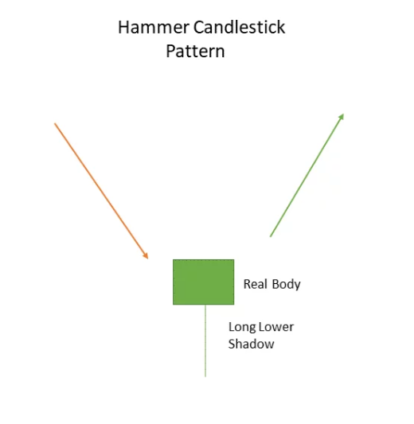

The Hammer candlestick pattern is formed when the price of an asset experiences a sharp decline, followed by a rally back to close near the opening price. The pattern is named after its shape, which resembles a hammer.

A typical Hammer candlestick pattern has the following characteristics:

The body of the candlestick is small and located at the lower end of the price range.

The lower shadow is long and at least two times the length of the body. This represents the sharp decline in price.

The upper shadow is small or non-existent, indicating that the price did not move much higher after the decline.

The color of the body is not important in this pattern, but a green body (closing price higher than the opening price) is more bullish than a red body (closing price lower than the opening price).

The Hammer pattern is considered a bullish reversal pattern because it signals that the bears were initially in control but the bulls took control towards the end of the period, pushing the price up to close near the opening price. The long lower shadow represents the selling pressure that was absorbed by the buyers, and the small upper shadow indicates that the bulls were able to maintain control.

It's important to note that the Hammer pattern should be confirmed by other technical indicators and analysis before making a trade decision. Traders should also look for other bullish reversal patterns to increase the probability of a trend reversal.

## Piercing Pattern
The Piercing Pattern is a bullish reversal candlestick pattern that is often observed in financial charts. It is used by technical analysts and traders to indicate a potential change in trend from a downtrend to an uptrend.
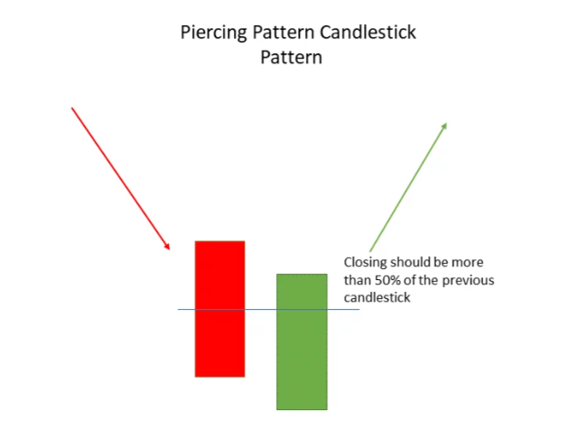

The Piercing Pattern is formed when a long red candlestick (indicating a bearish trend) is followed by a green candlestick that opens below the close of the prior red candlestick and closes above the midpoint of the prior red candlestick.

A typical Piercing Pattern has the following characteristics:

The first candlestick is red and long, representing a bearish trend.

The second candlestick opens below the close of the prior red candlestick and closes above the midpoint of the prior red candlestick. This represents the bullish reversal.

The green candlestick should have a long body, indicating a strong bullish move.

The green candlestick should have small or no shadows, indicating that there was little to no resistance from the bears.

The Piercing Pattern signals that the bears were initially in control but the bulls took control towards the end of the period, pushing the price up and closing it above the midpoint of the prior red candlestick. This represents a strong bullish reversal and the potential for a new uptrend.

It's important to note that the Piercing Pattern should be confirmed by other technical indicators and analysis before making a trade decision. Traders should also look for other bullish reversal patterns to increase the probability of a trend reversal.

## Bullish Engulfing
Bullish Engulfing is a bullish reversal candlestick pattern that signals a potential change in trend from a downtrend to an uptrend. The pattern is formed when a small red candlestick is followed by a large green candlestick, which completely "engulfs" the prior red candlestick.

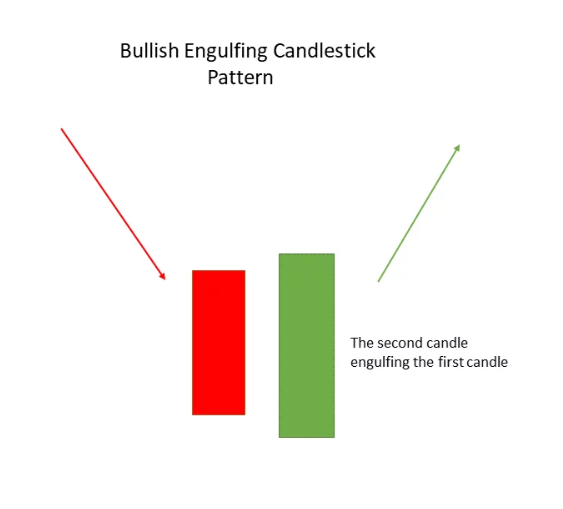

A typical Bullish Engulfing pattern has the following characteristics:

The first candlestick is red and small, representing a bearish trend.

The second candlestick is green and large, completely "engulfing" the prior red candlestick. This represents the bullish reversal.

The green candlestick should have a long body, indicating a strong bullish move.

The green candlestick should have small or no shadows, indicating that there was little to no resistance from the bears.

The Bullish Engulfing pattern signals that the bulls took control of the market and pushed the price higher, closing it above the open of the prior red candlestick. This represents a strong bullish reversal and the potential for a new uptrend.

It's important to note that the Bullish Engulfing pattern should be confirmed by other technical indicators and analysis before making a trade decision. Traders should also look for other bullish reversal patterns to increase the probability of a trend reversal.

## Morning Star
The Morning Star candlestick pattern is a bullish reversal pattern that signals a potential change in trend from a downtrend to an uptrend. It is formed by three candlesticks and is considered a reliable reversal pattern.

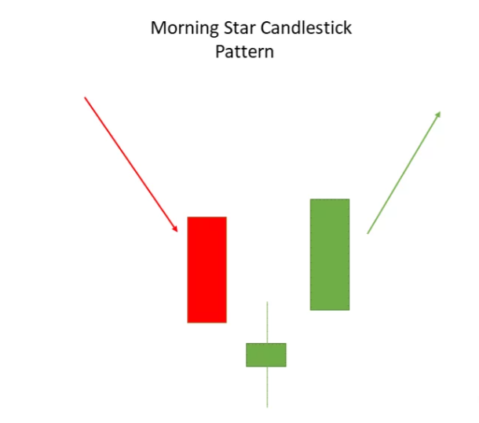

A typical Morning Star pattern has the following characteristics:

The first candlestick is a long red or bearish candle, representing the downtrend.

The second candlestick is a small candle with a real body of either color, representing indecision or a possible reversal.

The third candlestick is a large green or bullish candle, representing the uptrend.

The Morning Star pattern is considered a bullish reversal pattern because the small candle in the middle signals a potential reversal in the downtrend. The long green candle confirms the reversal and the potential for a new uptrend.

It's important to note that the Morning Star pattern should be confirmed by other technical indicators and analysis before making a trade decision. Traders should also look for other bullish reversal patterns to increase the probability of a trend reversal.

## Three White Soldiers
The Three White Soldiers candlestick pattern is a bullish reversal pattern that signals a potential change in trend from a downtrend to an uptrend. It is formed by three consecutive white or green candlesticks, with each candle closing higher than the previous one, representing a strong bullish momentum.

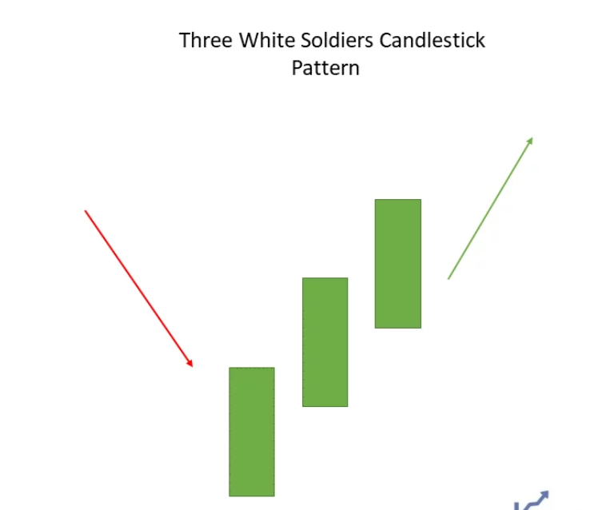

A typical Three White Soldiers pattern has the following characteristics:

The first candlestick is a long green or white candle, representing the start of the uptrend.

The second candlestick is also a long green or white candle, representing the continuation of the uptrend.

The third candlestick is another long green or white candle, representing the strengthening of the uptrend.

The Three White Soldiers pattern is considered a strong bullish reversal pattern because the consecutive white candles signal a strong bullish momentum, indicating that the downtrend may be coming to an end. The pattern is also considered to be a reliable signal of a potential trend reversal.

It's important to note that the Three White Soldiers pattern should be confirmed by other technical indicators and analysis before making a trade decision. Traders should also look for other bullish reversal patterns to increase the probability of a trend reversal.

## White Marubozu
The White Marubozu is a single candlestick pattern that is used to signal a strong bullish trend. It is formed when a white or green candlestick has no shadows or wicks on either end, indicating a strong and sustained move higher.

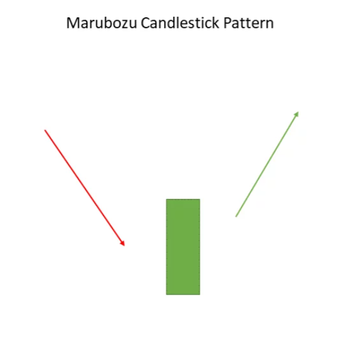

A typical White Marubozu has the following characteristics:

The open price and close price of the candle are the same or very close to each other.

There is no upper shadow, meaning that the high price for the period was reached early on and maintained throughout the period.

There is no lower shadow, meaning that the low price for the period was reached early on and maintained throughout the period.

The White Marubozu signals a strong bullish trend, as it indicates that the buying pressure was strong and sustained throughout the trading period. This pattern is often seen as a confirmation of a bullish trend, particularly if it occurs after a bearish trend or during a bullish reversal.

It's important to note that the White Marubozu pattern should be confirmed by other technical indicators and analysis before making a trade decision. Traders should also look for other bullish reversal patterns to increase the probability of a trend reversal.

## Three Inside Up
The Three Inside Up candlestick pattern is a bullish reversal pattern that signals a change from a downtrend to an uptrend. It is formed by three candlesticks, with the first being a long red or black candle that represents a bearish trend, followed by a smaller red or black candle, and finally a white or green candle that closes above the high of the first candle.

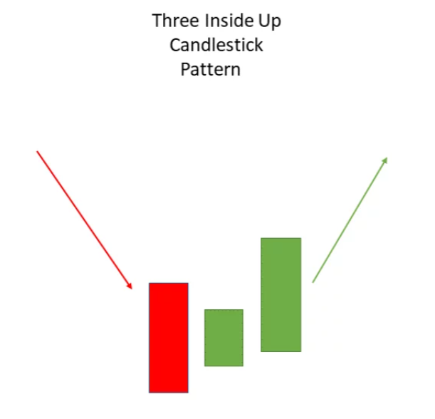

Here is a typical Three Inside Up pattern:

The first candle is a long red or black candle that represents a bearish trend.

The second candle is a smaller red or black candle that opens lower than the first candle and closes above the midpoint of the first candle.

The third candle is a white or green candle that opens above the close of the second candle and closes higher than the high of the first candle.

The Three Inside Up pattern is considered a bullish reversal pattern because it indicates that the bears have lost control and the bulls have taken over. The first two candles show that the bears are still in control, but the third candle shows that the bulls are starting to take control and push prices higher.

It's important to note that the Three Inside Up pattern should be confirmed by other technical indicators and analysis before making a trade decision. Traders should also look for other bullish reversal patterns to increase the probability of a trend reversal.

## Bullish Harami
The Bullish Harami is a candlestick pattern that signals a potential reversal from a downtrend to an uptrend in a financial instrument. It is a two-candlestick pattern that is typically formed during a downtrend and suggests a potential change in trend direction.

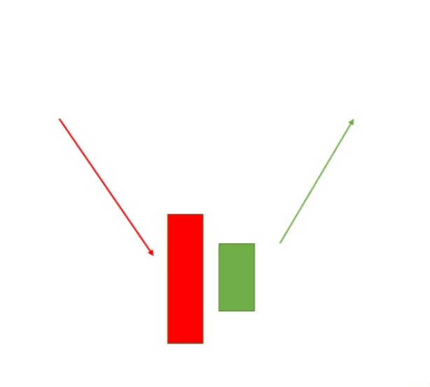

Here is a typical Bullish Harami pattern:

The first candle is a long red or black candle that represents a bearish trend.

The second candle is a smaller candle that opens higher than the first candle and closes either above or below the midpoint of the first candle. This candle is either white or green, indicating a potential bullish reversal.

The Bullish Harami pattern is formed when the second candle is inside the range of the first candle, which is why it is called a "harami," meaning "pregnant" in Japanese. The smaller size of the second candle and its location inside the first candle suggest that the bears are losing control and the bulls are starting to take over.

It's important to note that the Bullish Harami pattern should be confirmed by other technical indicators and analysis before making a trade decision. Traders should also look for other bullish reversal patterns to increase the probability of a trend reversal. Additionally, the Bullish Harami pattern is considered a relatively weak reversal signal, so traders should be cautious when interpreting this pattern.

## Tweezer Bottom
The Tweezer Bottom is a bullish reversal candlestick pattern that occurs at the end of a downtrend and signals the potential start of an uptrend. The pattern consists of two or more candles that have the same low price and form a "tweezer" shape.

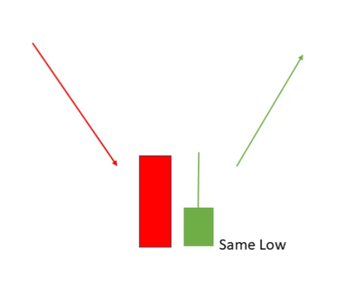

Here's how a typical Tweezer Bottom pattern looks like:

The first candle is a red or black bearish candle that represents the downtrend.

The second candle is a green or white bullish candle that opens lower than the first candle but closes at the same low price. This candle forms the bottom of the tweezer shape.

The subsequent candles can be either bullish or bearish but should confirm the uptrend.

The Tweezer Bottom pattern is considered a bullish reversal signal because it shows that the bears have lost control and the bulls are starting to take over. The pattern is considered stronger when it occurs after a downtrend and is confirmed by other technical indicators, such as support and resistance levels, trend lines, and momentum indicators.

It's important to note that the Tweezer Bottom pattern is not a guarantee of an uptrend, and traders should use other technical analysis tools to confirm the trend change before making a trade decision. Additionally, the pattern should be evaluated in the context of the overall market trend and the specific stock or financial instrument being analyzed.

## Inverted Hammer
The Inverted Hammer candlestick is a bullish reversal pattern that signals the potential start of an uptrend after a downtrend. The pattern consists of a single candle and its appearance signals a potential trend change in the market.

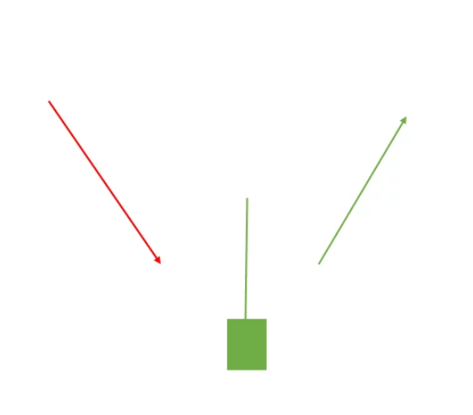

Here's how the Inverted Hammer pattern looks like:

The single candle is usually long and has a small or no lower shadow.

The upper shadow is at least two times the body length and is preferably longer.

The real body is located at the upper end of the trading range and is preferably white or green, which indicates a bullish reversal.

The Inverted Hammer pattern suggests that the bears have lost control and the bulls have taken over. However, the pattern is considered more significant when it occurs after a downtrend and is confirmed by other technical indicators, such as support and resistance levels, trend lines, and momentum indicators.

It's important to note that the Inverted Hammer pattern is not a guarantee of an uptrend, and traders should use other technical analysis tools to confirm the trend change before making a trade decision. Additionally, the pattern should be evaluated in the context of the overall market trend and the specific stock or financial instrument being analyzed. Traders should also wait for confirmation of the trend change in the following candles before taking a trade decision.

## Three Outside Up
The Three Outside Up candlestick pattern is a bullish reversal pattern that signals the potential start of an uptrend after a downtrend. The pattern is composed of three candles and its appearance is a strong indication of a potential trend change in the market.

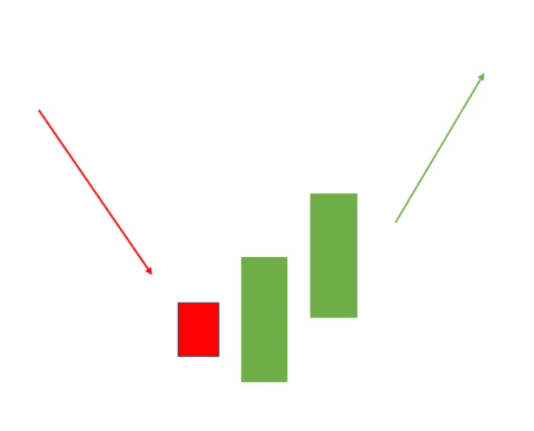

Here's how the Three Outside Up pattern looks like:

The first candle is a long red candle, which signifies a downtrend.

The second candle is a small candle that is located within the range of the first candle and is either bullish or bearish.

The third candle is a long white candle that closes above the high of the first candle, thereby "outside" the range of the first candle.

The Three Outside Up pattern suggests that the bears have lost control and the bulls have taken over. The pattern is considered more significant when it occurs after a downtrend and is confirmed by other technical indicators, such as support and resistance levels, trend lines, and momentum indicators.

It's important to note that the Three Outside Up pattern is not a guarantee of an uptrend, and traders should use other technical analysis tools to confirm the trend change before making a trade decision. Additionally, the pattern should be evaluated in the context of the overall market trend and the specific stock or financial instrument being analyzed. Traders should also wait for confirmation of the trend change in the following candles before taking a trade decision.

## On-Neck
The On-Neck Pattern is a bearish reversal candlestick pattern that is formed when a small real body appears on top of a long real body in a downtrend. 

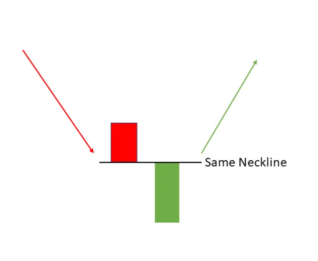

The small real body is formed after a strong downward trend and indicates that the selling pressure is losing steam, as the bears are becoming weaker and the bulls are starting to push prices up. This pattern signals a potential trend reversal and suggests that the market is due for a bounce, with the traders taking control from the bears. To confirm the On-Neck pattern, traders look for a close above the high of the small real body, which signals a stronger bullish reversal. However, it's important to note that the On-Neck pattern by itself is not a guaranteed indicator of a trend reversal, and traders should always look for additional confirmation through technical analysis and market indicators.

## Bullish Counterattack
The Bullish Counterattack is a bullish reversal candlestick pattern that occurs after a downtrend. The pattern is formed by two candlesticks, with the first being a long bearish candle, indicating strong selling pressure and a downward trend. The second candlestick is a long bullish candle, indicating that the buying pressure has overpowered the selling pressure and the price has reversed direction.

The Bullish Counterattack pattern signals a potential trend reversal and suggests that the market is due for a bounce. To confirm the pattern, traders look for a close above the high of the first bearish candle, which signals a stronger bullish reversal. Additionally, traders may also look for other bullish indicators, such as increasing volume or a bullish crossover in momentum indicators.

It's important to note that the Bullish Counterattack pattern is not a guaranteed indicator of a trend reversal, and traders should always look for additional confirmation through technical analysis and market indicators. Also, the pattern may occur in a ranging market, so traders should be careful not to make a trade based solely on this pattern without considering the larger market context.

---

# Bearish candlestick patterns
Bearish candlestick patterns are used in technical analysis to indicate a potential reversal in price direction from bullish to bearish. There are several bearish candlestick patterns that traders can use to help make investment decisions.

- Bearish Engulfing: This pattern is characterized by a large bearish candle that completely engulfs the previous bullish candle. It is considered a strong reversal signal and indicates a potential trend change from bullish to bearish.

- Dark Cloud Cover: This pattern is created when a bearish candle opens above the previous bullish candle's high and closes below its midpoint. This suggests that the bullish trend may be losing steam.

- Hanging Man: This pattern is created when a small real body is formed near the top of a bullish trend and has a long lower shadow. It signals that the bulls may be losing control, and a bearish reversal may be imminent.

- Shooting Star: This pattern is created when a small real body forms near the bottom of a bullish trend and has a long upper shadow. It signals a potential reversal of the bullish trend to bearish.

- Bearish Harami: This pattern is created when a small real body forms within the range of a larger real body. The small real body can be bullish or bearish, but the direction of the pattern is determined by the direction of the larger real body. This pattern signals a potential reversal of the bullish trend to bearish.

- Tweezer Top: This pattern is created when two or more candle highs are at the same level and a bearish candle forms after the highs. It signals a potential reversal of the bullish trend to bearish.

- Bearish Inverted Hammer: This pattern is created when a small real body forms near the bottom of a bullish trend and has a long upper shadow. It signals a potential reversal of the bullish trend to bearish.

- Three Black Crows: This pattern is created when three bearish candles form in a row and each successive candle opens within the real body of the previous candle. It is a strong bearish reversal signal.

- Black Marubozu: This pattern is created when a bearish candle has no upper shadow and a lower shadow that is less than the length of the real body. It is a strong bearish reversal signal.

It's important to note that while these patterns can be useful indicators, they should be used in conjunction with other analysis methods and not solely relied upon to make investment decisions.

## Hanging Man
The Hanging Man candlestick pattern is a bearish reversal pattern that occurs at the end of an uptrend. It is formed when a small real body (black or white) appears at the top of an extended price move, with a long lower shadow (wick) that is at least twice the length of the real body. The long lower shadow indicates that bears have pushed prices down, but the bulls have pushed prices back up, keeping the real body small. The presence of a small real body also shows that bears were unable to sustain their selling pressure. The Hanging Man is a strong reversal signal and suggests that a top is forming and that a trend change is likely. It is important to wait for confirmation, such as a bearish candle the next day, before making a trade based on this pattern.

## Dark Cloud Cover
The Dark Cloud Cover is a bearish reversal pattern in candlestick chart analysis. It occurs after an uptrend and signals a potential top in the price. The pattern consists of two candles. The first candle is a long white candle, representing bullish buying activity. The second candle is a black candle that opens above the close of the previous white candle, but closes well into the body of the first candle, suggesting a shift in control from the bulls to the bears.

The Dark Cloud Cover is considered a bearish reversal pattern because it shows that the bulls were unable to maintain control of the market, as the bears take over and push the price down. The length of the two candles and the extent of the second candle’s downward penetration into the first candle are important in determining the strength of the pattern.

Traders look for confirmation of the bearish reversal before taking short positions, such as a decline in the trading volume or a decline in the relative strength index (RSI). The Dark Cloud Cover pattern is a useful tool for traders and investors to identify potential short-term market tops and make informed investment decisions.

## Bearish Engulfing
The Bearish Engulfing candlestick pattern is a two-candle reversal pattern that signals the potential for a bearish trend reversal. It consists of a small bullish candle followed by a large bearish candle that completely engulfs the preceding candle.

The pattern forms when the market opens higher and closes lower, with the close of the bearish candle below the open of the bullish candle. This pattern indicates that bears have taken control of the market and are pushing prices lower. Traders may interpret this pattern as a sign to sell or short the stock.

It's important to note that the Bearish Engulfing pattern is most effective when it occurs after an uptrend, and when it is confirmed by other technical analysis tools or indicators. It is also more significant when the bearish candle has a long real body, indicating strong bearish sentiment.

## Evening Star
The Evening Star candlestick pattern is a three-candle bearish reversal pattern that signals a potential trend reversal from bullish to bearish in a financial market. The pattern is formed when the following conditions are met:

First candle: a long bullish candlestick that closes near the high of the day and shows strong buying pressure.

Second candle: a small candle with a long upper shadow that opens above the high of the previous candle. This candle may or may not have a real body, but it is critical that it opens above the previous day's close.

Third candle: a bearish candlestick that opens below the close of the previous candle and closes below the midpoint of the first candle's body.

The Evening Star pattern is considered a bearish reversal pattern because it suggests that the bullish trend is coming to an end and that the market is likely to reverse direction and start moving downwards. Traders use the Evening Star pattern as a signal to exit long positions or to initiate short positions. However, it is important to note that this pattern should not be used in isolation, and other factors such as volume, support and resistance levels, and market sentiment should be considered when making trading decisions.

## Three Black Crows
The Three Black Crows candlestick pattern is a bearish reversal pattern that is typically formed at the end of an uptrend. It consists of three consecutive long black candlesticks with consecutively lower closes. The long black candles indicate a significant increase in selling pressure and indicate that the bears have taken control of the market. Each candle should have relatively small or no upper shadow, indicating that the bears have been able to push prices lower throughout the entire trading session. The pattern signals that the bulls are losing momentum and that a trend reversal to the downside is likely to occur. It is important to note that the pattern is stronger if it appears after an extended uptrend and if the volume is increasing during the formation of the pattern.

## Black Marubozu
The Black Marubozu candlestick is a bearish reversal pattern that signals a potential trend change from bullish to bearish. It is formed when the price opens near the high of the day and closes near the low, with no upper shadow or lower shadow. The long black body represents strong selling pressure and a strong bearish sentiment. This pattern can indicate a potential trend reversal in a bullish market and is often seen as a warning sign for traders to be cautious and consider selling positions.

## Three Inside Down
The Three Inside Down candlestick pattern is a bearish reversal pattern that is used to indicate a potential trend change in a security's price. The pattern is comprised of three candlesticks and is formed when the price closes lower than the previous day's close for three consecutive days.

The first candlestick in the pattern is a long bullish candlestick, indicating a bullish trend. The second candlestick is a small bullish or bearish candle that forms within the real body of the first candle. The third and final candlestick is a large bearish candle that closes well below the low of the first candle.

This pattern signals that a bullish trend has lost momentum and that bears have taken control. Traders and investors who use technical analysis often look for this pattern to indicate a potential shorting opportunity or to exit long positions.

It's important to note that this pattern is not always a guarantee of a trend change, and it should be used in conjunction with other technical analysis tools and indicators for confirmation.

## Bearish Harami
The Bearish Harami is a two-candlestick pattern in technical analysis that signals a potential trend reversal from bullish to bearish. It is formed when a large green (bullish) candlestick is followed by a small red (bearish) candlestick that is completely contained within the real body of the first candle.

The first candle represents bullishness, as prices have opened high and closed even higher. The second candle, however, suggests indecision or potential bearishness, as prices have opened below the previous close and closed within the previous real body.

Traders often look for confirmation of the trend reversal by observing the price action in the following candles. A bearish follow-through, such as a red candlestick closing below the low of the second candle in the Bearish Harami pattern, can indicate a trend reversal and a potential short-selling opportunity.

It is important to note that the Bearish Harami pattern is only a potential trend reversal signal and should be used in conjunction with other technical analysis tools and indicators.

## Shooting Star
 The Shooting Star candlestick pattern is a bearish reversal pattern that forms after a bullish trend in an asset's price. It is characterized by a small real body (typically a Doji) near the low of the period, with long upper shadow and little or no lower shadow.

The appearance of the Shooting Star pattern suggests that the asset's price rose significantly during the period, but was unable to hold onto its gains and closed near the low. This could be a sign of impending price decreases, as the bears took control of the market and pushed prices down.

It is important to note that the Shooting Star pattern should only be considered a bearish reversal signal after a bullish trend and should be confirmed by other technical analysis tools and indicators before making a trading decision.

## Tweezer Top
The Tweezer Top candlestick pattern is a bearish reversal pattern that signals a potential trend change in the market. It consists of two or more candles that have the same high price, with the second candle being a red or bearish candle. The pattern forms when the price of an asset rises to a new high, but is unable to maintain that level and closes lower, forming a tweezer-like shape on the chart. This is a bearish signal as it suggests that the bears have taken control of the market and that the price may continue to fall. Traders often use this pattern in combination with other technical analysis tools to confirm a trend reversal, and to make informed trading decisions.

## Three Outside Down
The Three Outside Down candlestick pattern is a bearish reversal pattern that occurs in a downtrend. It consists of three candles, where the first candle is a long red candle, the second candle is a small green candle that opens above the previous close and closes within the first candle, and the third candle is a long red candle that opens below the second candle and closes well into the first candle's body. The pattern is considered bearish because it indicates that the bears have taken control and are pushing the price down. The length and size of the first and third candles are important in determining the strength of the reversal signal. The pattern suggests that the market is likely to continue to move lower, and traders should look to short the market or consider protective measures to manage their risk.

## Bearish Counterattack
The Bearish Counterattack candlestick pattern is a bearish reversal pattern that occurs after a bullish trend. It is comprised of two candles, the first one being a long white candle representing a bullish trend, followed by a black candle that opens higher than the previous day’s close and closes near the low of the previous day. The pattern signals a potential trend reversal, indicating that the bears have taken control of the market, and the bears have overwhelmed the bulls. This pattern is significant as it shows a shift in momentum from bullish to bearish, and traders should be cautious of entering new long positions. The bearish counterattack is often considered to be a stronger reversal signal when it occurs after a prolonged bullish trend.

In order to confirm the bearish counterattack pattern, it is important to look for additional bearish technical signals such as a downward trend line or bearish moving averages. Additionally, it is important to consider market sentiment and other fundamental factors that may be contributing to the trend reversal. It is always important to use multiple technical and fundamental indicators when making trading decisions to help ensure the validity of the signals.

---

# Continuation candlestick patterns
Continuation candlestick patterns are technical analysis chart patterns that indicate a potential trend continuation in the current market direction. They are formed when there is a pause or consolidation in price action, and the market is expected to continue in the direction of the previous trend.

There are two main types of continuation patterns: bullish continuation patterns and bearish continuation patterns. Bullish continuation patterns are signals that a bullish trend is likely to continue, while bearish continuation patterns suggest that a bearish trend is likely to persist.

Bullish continuation patterns include:
- Flag and Pennant
- Rectangle
- Ascending Triangle

Bearish continuation patterns include:
- Flag and Pennant
- Rectangle
- Descending Triangle

It's important to note that while continuation patterns indicate a potential trend continuation, they are not always reliable and should be used in conjunction with other technical analysis tools and indicators to make informed trading decisions.

## Doji
A Doji candlestick is a type of reversal pattern that forms in the stock market. It is a unique candle that appears in the price chart of a stock or security and provides information about the trend change.

A Doji occurs when the opening and closing prices are equal or almost equal. It represents a tie between the bulls and the bears in the market, indicating indecision and a possible reversal in trend. A Doji candle is formed when the market has been in a trend and then a shift in sentiment occurs. The long shadow on either side represents the difference between the opening and closing price and the high and low prices of the security during the trading day.

A Doji is considered bullish or bearish based on the preceding trend and the pattern that forms after the Doji candle. If the Doji forms after a downtrend, it is considered bullish and signals a potential reversal to the upside. If it forms after an uptrend, it is considered bearish and signals a potential reversal to the downside.

In conclusion, the Doji is a significant pattern in technical analysis and should be considered along with other indicators and price action when making investment decisions.

## Spinning Top
The Spinning Top candlestick pattern is a type of reversal pattern that is formed when the stock price is volatile and has both bullish and bearish sentiments within the trading day. The pattern is recognized by a small real body that can be either bullish or bearish, with long upper and lower shadows. The real body of the candle represents the difference between the opening and closing prices of the security, while the upper and lower shadows represent the highest and lowest prices of the security during the day.

A Spinning Top candlestick pattern indicates a lack of clear direction in the stock price, as both the bulls and the bears have been active in the market, leading to an indecisive pattern. This pattern can appear in an uptrend or a downtrend, and traders usually use it in combination with other technical analysis tools to make a more informed decision.

In an uptrend, a Spinning Top candlestick pattern can be a bearish reversal signal, suggesting that the momentum of the uptrend is slowing down and that the bears are trying to take control. In a downtrend, it can be a bullish reversal signal, indicating that the bears are losing strength and the bulls are trying to push the price up.

Overall, the Spinning Top candlestick pattern is an important tool for technical analysts to understand the behavior of the stock price, but it should not be relied upon as a standalone indicator. Traders should always consider other factors such as market conditions and economic data before making a trading decision.

## Falling Three Methods
The Falling Three Methods is a bearish reversal candlestick pattern in technical analysis that appears at the end of an uptrend. The pattern is formed by three long red candles, each with a lower close than the previous one. This indicates that the bears are in control of the market and that the trend is likely to reverse and become bearish. The candles are typically long because the bears are actively pushing prices lower.

Each of the three candles in the Falling Three Methods pattern should have relatively small upper shadows and relatively large lower shadows. This suggests that the bears are in control of the market and that there is little resistance from the bulls.

Traders look for the Falling Three Methods pattern as a sign that the uptrend is losing momentum and that it may be time to exit long positions or enter short positions. The pattern can also be used to confirm other bearish signals, such as a break below a trendline or a bearish crossover on a momentum indicator.

It's important to note that the Falling Three Methods pattern is not a guarantee that the trend will reverse, but it can be used as a signal to closely monitor the market and make informed trading decisions.

## Rising Three Methods
Rising Three Methods candlestick pattern is a bullish reversal pattern that appears at the end of a downtrend or in a consolidation period. It signals a potential change in trend direction from bearish to bullish. The pattern is made up of five individual candles, with the middle three candles being small-bodied and showing little price movement. The first and last candles are long and bullish, with the first candle having a lower low and the last candle having a higher high compared to the middle three candles.

The pattern shows that although the bears were in control in the first candle, the bulls started to gain strength and push prices higher in the last candle, suggesting a potential trend reversal. Traders and investors watch for this pattern to enter a long position, betting on a potential upward price movement. However, it is important to confirm the pattern with other technical analysis tools before making a trading decision.

## Upside Tasuki Gap
The Upside Tasuki Gap is a bullish candlestick pattern that appears during an uptrend in the stock market. It is formed when three consecutive candles have long real bodies and little or no upper shadows, with each high being higher than the previous one. The middle candle is typically larger than the other two and gaps above and below the previous and following candles, creating a tasuki pattern.

The Upside Tasuki Gap is considered a bullish reversal pattern and signals a potential trend reversal from bearish to bullish. Traders may use this pattern as a buying opportunity and place a long position. However, it is important to keep in mind that like any other technical analysis tool, the Upside Tasuki Gap should be used in conjunction with other fundamental and technical analysis to confirm the reversal signal.

## Downside Tasuki Gap
The Downside Tasuki Gap is a bearish candlestick pattern that occurs during a downtrend and suggests a potential trend reversal. It consists of three candles:

The first candle is a long red candle that opens near the low of the day and closes near the high of the day, indicating strong bearish sentiment.

The second candle is a short red or green candle that opens above the previous day's high and closes within the range of the first candle, creating a gap between the two candles known as the Tasuki Gap.

The third candle is a long red candle that opens near the high of the second candle and closes below the low of the first candle, confirming the bearish sentiment.

The Downside Tasuki Gap pattern suggests that the bears have taken control of the market and may indicate a potential trend reversal from bullish to bearish. Traders often use this pattern in conjunction with other technical analysis tools to confirm the trend reversal.

## Rising Window
The Rising Window candlestick pattern is a bullish reversal pattern that is formed after a downtrend. It occurs when a candle's high breaks above the high of the previous candle, creating a gap between the two candles, and the next candle opens below the previous candle's close but closes above its high, completely "filling the gap." This pattern suggests that the bears have lost control and the bulls are taking over, indicating a potential change in the trend direction. The rising window signals a possible trend reversal and is considered a bullish reversal pattern when formed after a downtrend.

## Falling Window
The Falling Window is a bearish reversal candlestick pattern that occurs after an uptrend. It consists of two or more red candlesticks that are found in close proximity to each other and have their lows close to or touching. The pattern suggests that the bears have taken control of the market and are likely to push prices down in the near future.

The pattern is formed when the high of the first red candlestick is above the high of the previous green candlestick and the low of the second red candlestick is below the low of the first red candlestick. This creates a “window” between the two red candles where no green candle appears. The lack of a green candle in this area signals that the bulls have lost control of the market and the bears have taken control.

The Falling Window candlestick pattern is considered to be a reliable bearish reversal pattern and traders often use it in conjunction with other technical analysis tools to confirm the trend change. It is important to note that the Falling Window pattern is more significant if it occurs after a prolonged uptrend and if it is found near a key resistance level.

## High Wave
The High Wave candlestick pattern is a reversal pattern that signals indecision in the market. It is characterized by a long real body with little or no upper or lower shadow. The real body of the High Wave candlestick pattern can be either bullish or bearish, indicating either buying or selling pressure.

The long real body of the High Wave pattern suggests that prices have moved significantly during the period in question, however, the lack of shadows indicates a lack of commitment from either buyers or sellers. This indecision often leads to a change in market direction.

For a bullish High Wave pattern, the real body should be green or white and located at the upper end of the trading range for the period. For a bearish High Wave pattern, the real body should be red or black and located at the lower end of the trading range.

It is important to note that the High Wave pattern is relatively rare and should be confirmed by other technical analysis tools and market indicators before making a trading decision.

